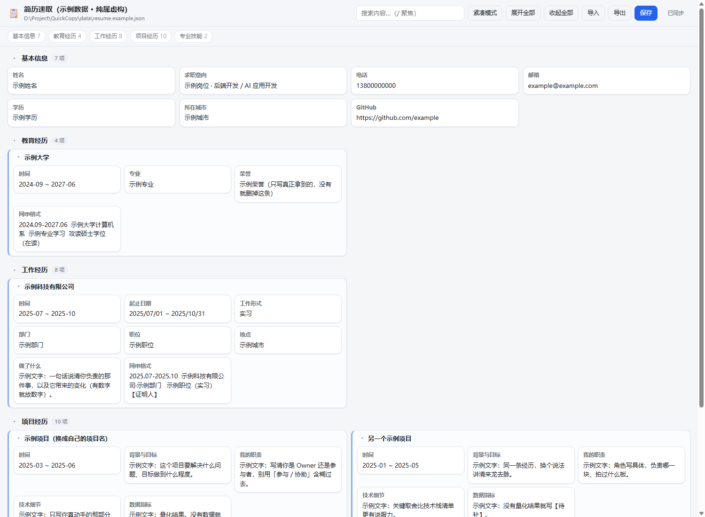

# 简历速取（QuickCopy）

一个跑在本机的网页小工具：把简历信息按「分类 → 经历 → 字段」的层级铺成一屏小卡片，
**点一下卡片就把文字复制到剪贴板**，专门用来填各种网申表单、猎头表格。

数据是本地 JSON 文件，页面自动加载、自动保存，可导入导出。



> 仓库里带的是**示例数据**（`data/resume.example.json`）：人名、单位、数字全是占位符
> （「示例姓名」「示例大学」「示例科技有限公司」），截图里的内容也是它渲染出来的。
> 示例里那条项目刻意按 **背景与目标 → 我的职责 → 技术细节 → 数据指标** 四段式排下来——
> 这套结构的作用是逼你把话讲清楚，边界是**只放大、不虚构**，所以字段提示语写成了
> 「没有数据就老实写 `【待补】`，别编」。
>
> 你自己的简历请放在 `data/resume.json`——该文件已被 `.gitignore` 排除，不会进入 Git 历史。

## 快速开始

需要 Node.js 18+（本机已装则直接下一步）。

| 平台 | 启动方式 |
| --- | --- |
| **Windows** | 双击 **`start-tray.vbs`** —— 无黑窗，通知区域出图标（推荐） |
| Windows（想看着日志跑） | 双击 `start.bat` |
| macOS / Linux / Git Bash | `./start.sh` |
| 任意平台 | `node server.js` |

浏览器会自动打开 <http://127.0.0.1:5178/>。默认监听 `0.0.0.0`，同一局域网内的设备可以用电脑的局域网 IP 访问，例如 `http://192.168.1.10:5178/`。

> **局域网访问说明**：请仅在受信任的家庭 / 办公网络中使用，并在系统防火墙中放行该端口。服务没有登录或加密传输；IP 只用于区分配置，**不能作为身份验证**。同一 NAT 出口或反向代理后的设备可能被识别为同一个用户。

### 局域网独立配置

`data/resume.json` 是默认配置。局域网设备第一次打开页面时，会自动复制这份默认配置到 `data/profiles/` 下的独立文件；之后该设备的编辑、拖拽排序和自动保存只影响自己的配置，不会覆盖其他 IP 的内容。配置文件名仅保存 IP 的哈希值，避免直接把局域网地址写入文件名。

- 默认：按客户端 IP 分别保存配置。
- `--shared-data`：关闭隔离，所有设备共用 `data/resume.json`。
- `--per-ip`：显式开启按 IP 隔离（默认已开启）。

查看本机局域网 IP：Windows 在命令行执行 `ipconfig`，macOS / Linux 执行 `ip addr` 或 `ifconfig`；将显示的 IPv4 地址替换到上方链接即可。

### 托盘模式：`start-tray.vbs`

双击后没有任何控制台窗口，右下角通知区域（可能要先点「^」展开）会出现一个图标：

| 操作 | 效果 |
| --- | --- |
| 左键单击图标 | 打开页面 |
| 右键 → 打开页面 / 复制服务地址 | 同上，或把 `http://127.0.0.1:<端口>/` 复制走 |
| 右键 → 打开数据文件 / 数据文件夹 | 直接编辑 `resume.json` |
| 右键 → 查看服务日志 | 打开 `logs/server.log` |
| 右键 → 重启服务 | 重启 node（改完代码用得上） |
| 右键 → 退出 | 关掉服务与图标 |

几个行为说明：

- 端口默认从 5178 开始挑空闲的；被占用就自动往后挪，实际端口看托盘气泡或 `logs/tray.state.json`。
- **重复双击不会起第二个服务**，只会把已经开着的页面打开。
- 退出托盘时 node 也会跟着退出，不会留下占着端口的僵尸进程。
- 运行日志都在 `logs/`：`server.log`、`server.err.log`、`tray.state.json`。

`start.bat` / `start.sh` / 托盘都支持把参数原样透传给 `server.js`，例如 `start.bat --port 6000`。
用 `Ctrl+C` 或关窗口来停止（托盘模式则在菜单里退出）。

## 怎么用

| 操作 | 效果 |
| --- | --- |
| 点整段卡片的**标题** | 只复制这个名称（公司名 / 项目名 / 经历名） |
| 点卡片其他位置 | 叶子卡片复制内容；整段卡片复制**多行全文** |
| 拖拽卡片 | 在同一层级内调整卡片顺序；搜索时为避免误操作会暂时禁用 |
| 卡片右下角「展开 / 收起」 | 卡片默认严格限制为 2 行正文，点开可查看全文 |
| 卡片头部 ▾ | 折叠 / 展开这一段 |
| 卡片 hover 出现的按钮 | `＋` 在该条目下加字段，`✎` 编辑，`🗑` 删除 |
| 分类标题行的按钮 | `＋` 加卡片，`⊹` 加分类，`✎` 重命名，`🗑` 删除分类 |
| 顶部「紧凑模式」 | 列更窄、字号更小，一屏塞进更多信息 |
| 顶部「展开全部 / 收起全部」 | 批量折叠整页 |
| 搜索框 | 按标题和内容过滤（按 `/` 聚焦，`Esc` 清空）；命中父条目时保留整段 |
| 「导出」 | 下载一份 JSON 快照 |
| 「导入」 | 用 JSON 文件替换当前数据（原文件会先备份） |
| `Ctrl+S` | 立即保存 |

编辑后 **900ms 自动保存**回数据文件；也可以直接改文件，页面每 2.5 秒探测一次，
发现外部改动会自动重新加载（若页面上还有没保存的改动，会先弹提示让你选）。

## 数据文件

默认路径：`data/resume.json`（不存在时首次启动会自动创建空模板）

想先看效果，可以把示例数据复制成自己的数据文件：

```bash
cp data/resume.example.json data/resume.json
# Windows: copy data\resume.example.json data\resume.json
```

```bash
node server.js --data "D:/我的简历/resume.json"   # 换一个默认配置文件
node server.js --port 6000                        # 换端口
node server.js --shared-data                      # 所有人共用同一份数据
node server.js --no-open                          # 不自动开浏览器
```

结构就是一棵树，`children` 是父子层级，同一个 `children` 数组里的节点互为并列：

```json
{
  "version": 1,
  "title": "简历速取",
  "updatedAt": "2026-09-17T08:40:00.000Z",
  "sections": [
    {
      "id": "basic",
      "title": "基本信息",
      "children": [
        { "id": "basic-phone", "title": "电话", "value": "13800000000" }
      ]
    },
    {
      "id": "work",
      "title": "工作经历",
      "children": [
        {
          "id": "work-ict",
          "title": "某研究所 · 后端实习生",
          "children": [
            { "id": "work-ict-time", "title": "时间", "value": "2026-03 ~ 2026-07" },
            { "id": "work-ict-1", "title": "做了什么", "value": "……" }
          ]
        }
      ]
    }
  ]
}
```

字段含义：

- `title`：卡片标题 / 字段名
- `value`：卡片正文，**点击卡片复制的就是它**
- `copy`：可选，自定义点击时要复制的文本（留空则复制 `value`）
- `children`：下钻层级；没有 `children` 的节点就是一张小小的字段卡
- `id`：唯一标识，可省略（导入时会自动补），改了没关系

写错了也不怕：读取时会自动修掉空节点、补 `id`、忽略非法结构，页面顶部会提示。

每次保存前，旧文件都会留一份到 `data/backups/`（最多保留 20 份）。

## 目录结构

```
server.js            本地服务：静态托管 + 数据读写 API（零依赖，仅用 Node 内置模块）
start-tray.vbs       Windows 双击入口：无窗口启动托盘（ASCII-only，避免编码坑）
tray.ps1             Windows 托盘：挑端口、隐藏启动 node、图标与右键菜单
assets/quickcopy.ico 托盘图标（GDI+ 生成的 32x32）
public/index.html    页面骨架
public/styles.css    样式（含深色模式）
public/app.js        页面逻辑：渲染、复制、编辑、自动保存
public/core.js       纯逻辑层：树操作 / 校验 / 复制文本（浏览器与 Node 共用）
data/resume.example.json  示例数据（人名单位均为虚构，随仓库提交）
data/resume.json     默认配置（已被 .gitignore 排除）
data/profiles/       按访问 IP 生成的独立配置与备份（已被 .gitignore 排除）
data/backups/        共享数据模式的自动备份（已被 .gitignore 排除）
logs/                运行时日志（已被 .gitignore 排除）
test/                node:test 测试
.gitignore           排除真实简历数据、备份、日志、会话附件
```

## 开发

```bash
npm test        # 跑全部测试（core 逻辑 + HTTP 接口）
npm start       # 等同 node server.js
```

## 接口

| 方法 | 路径 | 说明 |
| --- | --- | --- |
| `GET` | `/api/data` | 读取当前 IP 的数据（首次访问从默认配置初始化） |
| `PUT` | `/api/data` | 写入当前 IP 的配置（校验 + 原子写 + 备份） |
| `GET` | `/api/meta` | 只取当前 IP 配置的路径与 mtime，用于探测外部改动 |

写入是「先写临时文件再 rename」，不会写出半截的 JSON。
